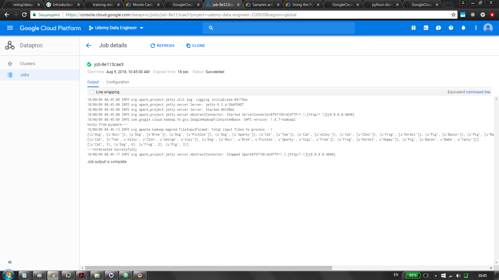

# dataproc-pyspark-mapreduce
runs a simple pyspark job on hadoop computing cluster managed by dataproc \
as per https://github.com/GoogleCloudPlatform/training-data-analyst/tree/master/courses/unstructured \
and per https://www.udemy.com/gcp-data-engineer-and-cloud-architect/learn/v4/t/lecture/7598404?start=0 \
and per https://codelabs.developers.google.com/codelabs/cloud-dataproc-starter/#4

## upload_to_bucket.sh
uploads init scripts, inputs and py stuff to cloud storage bucket \
usage ... bucket-name folder-name \
init scripts must have 'init' prefix \
input must be txt and must have 'input' prefix

## init_script.sh
installs py api client \
just an illustration, not needed here

## create_cluster.sh
create computing cluster \
uses basic config (1 master, 2 worker nodes..) \
runs 2 initialization scripts: \
init_script.sh see above \
datalab.sh from gcp \
for more templates see https://github.com/GoogleCloudPlatform/dataproc-initialization-actions

## how to
run upload.sh \
run create_cluster.sh \
(chmod u+x ...) \
submit job

## NB
the above does take into account auth for bucket files \
either make files in the bucket public, create iam rules for cluster, \
or access via oauth2 \
